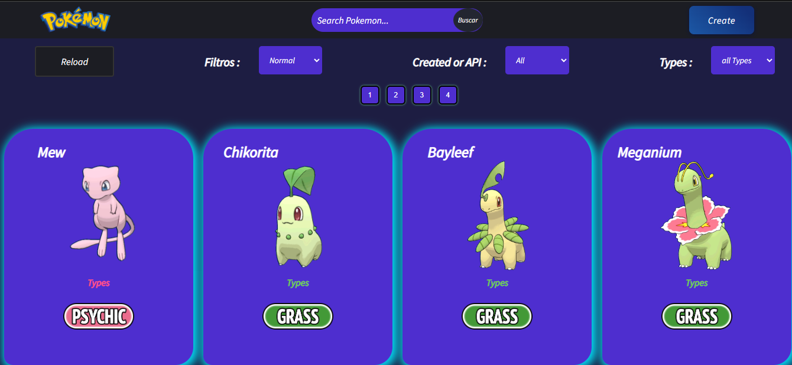
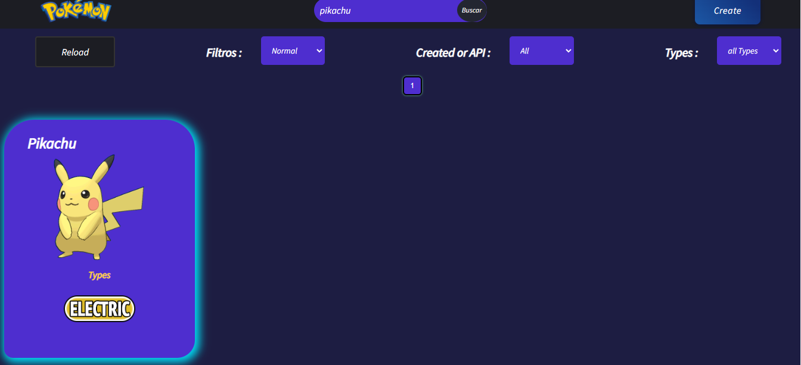
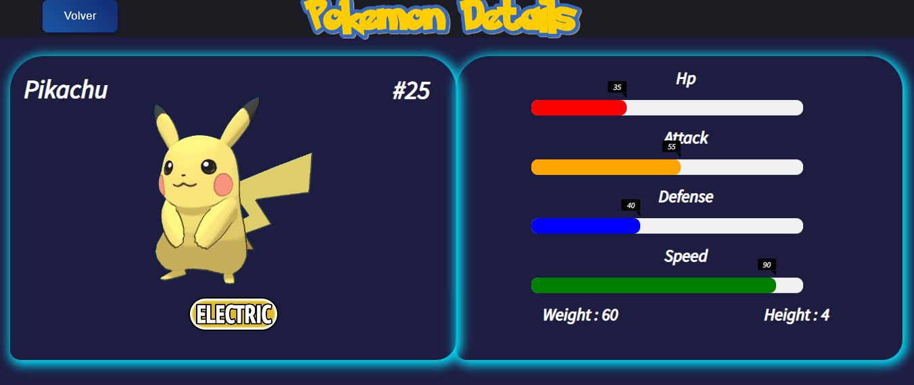
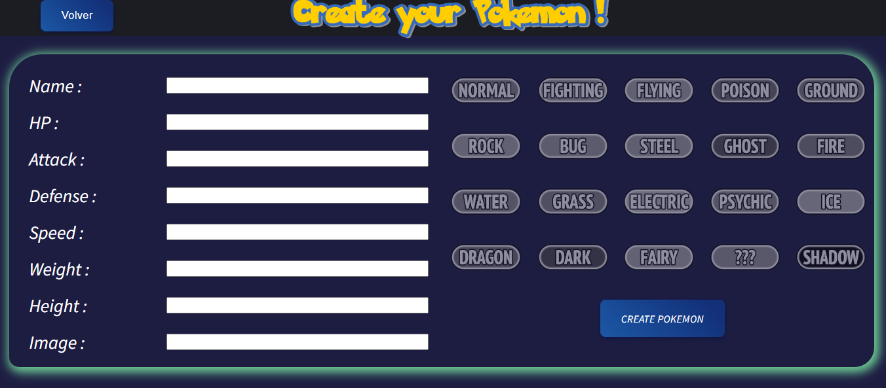
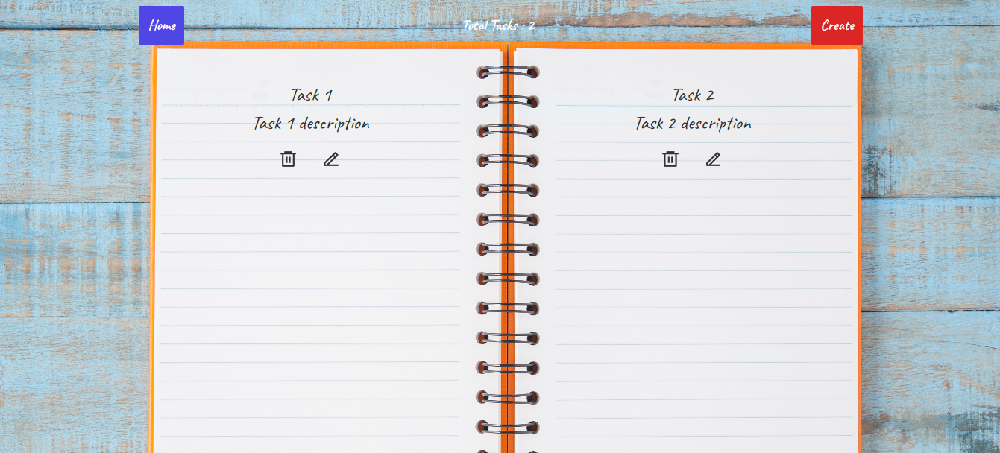
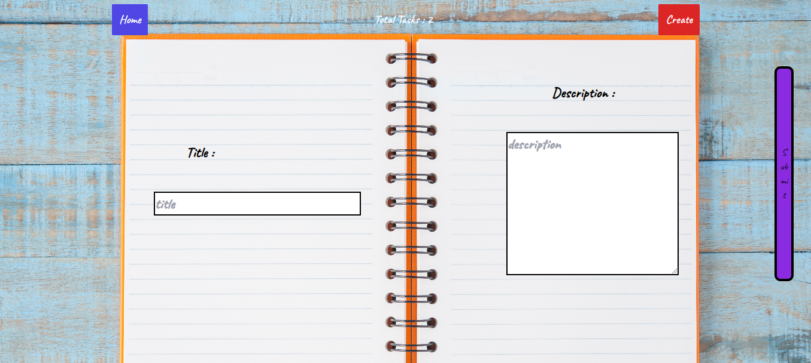
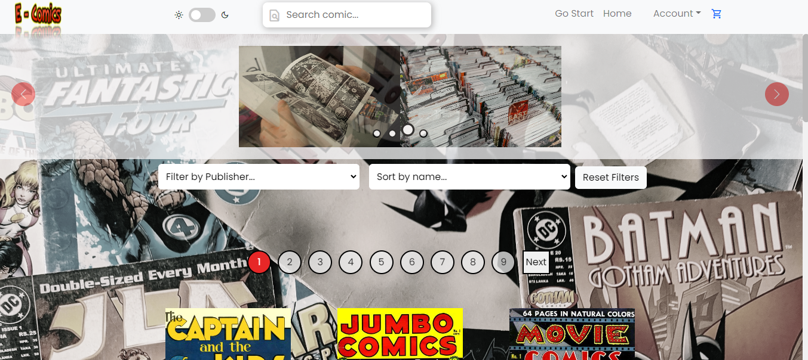
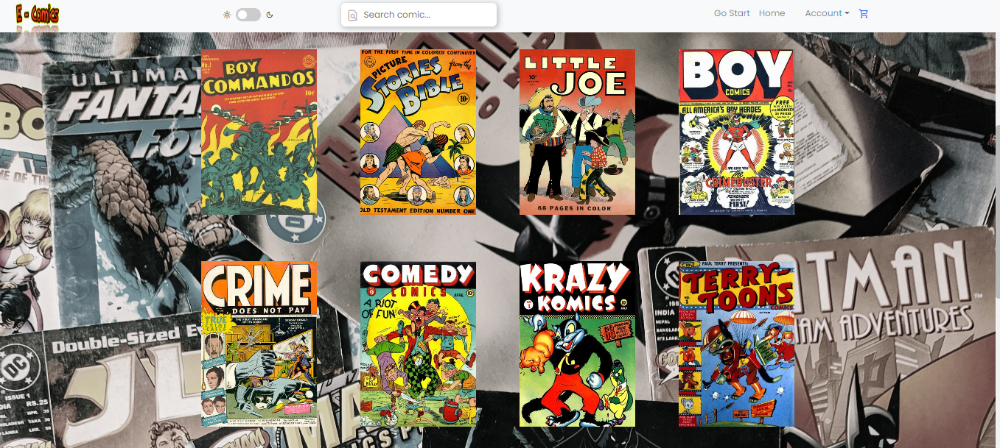
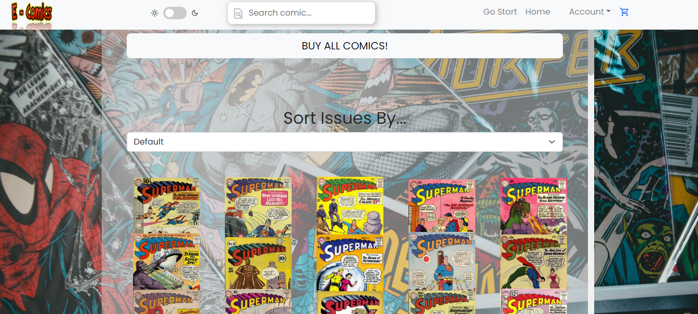
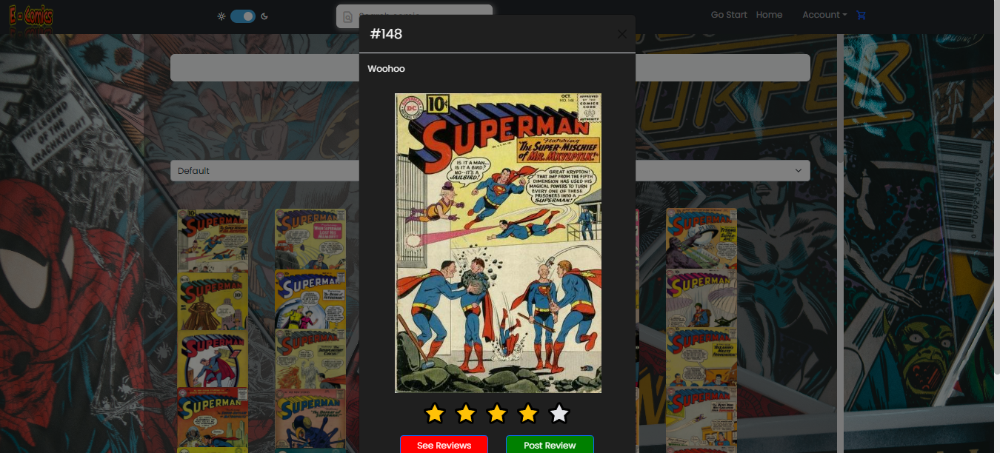

<h2 align="center">
FullStack Developer from Argentina 

</h2>

&nbsp;&nbsp;

## 💻 Languages and Tools:

  
  
  
  
  
  
   
  
  
  
  
  
  
   

&nbsp;

## :pushpin: My proyects

### Desarrollé una App de pokemons que incluía: búsquedas, filtrados, ordenamientos y creación
### Usando para el Front React, Redux, CSS puro y Back desarrollado en Node.js con Express. Base de datos en PostgreSQL y Sequelize.

 

  
  

  
  

<h2>Press to go deploy</h2>

### To do App, app que permite crear tareas, eliminar, editar
### Usando React, Redux Toolkit y React Router

 
  

 

<h2>Press to go deploy</h2>

&nbsp;

### E-comics ecommerce de comics. App que permite hacer compras de los comics, dejar reviews, ver los reviews de los demas compradores, sistema de login y autenticación por google
### Usando React, Redux, Bootstrap en el frontend y TypeScript, Node, Sequelize en el Backend

 
 
 
 

 

<h2>Press to go deploy</h2>

&nbsp;

## :paperclip: How to reach me:

<a href="www.linkedin.com/in/sergio-moyano07" target="_blank" > &nbsp;
<a href="mailto:smoyano07@hotmail.com.ar" >
</a>

 

# 📊 GitHub Stats:
 
---

